# 🚀 30diasCSS 🚀
 
### Desafio proposto por [Milena](https://github.com/MilenaCarecho/30diasDeCSS)  com o objetivo de praticar HTML5 e CSS3 por 30 dias.

### Regras gerais
* Realizar um projeto por dia
* Compartilhe seu progresso nas mídias sociais (Twitter, Facebook, Linkedin etc.) usando a hashtag #30diasDeCSS
* O projeto deve ser concluído até 23:59

 Dia 1 - Ícone de mídias sociais em camada

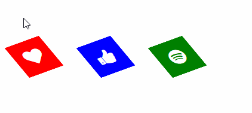

 Dia 2 - Loader animado

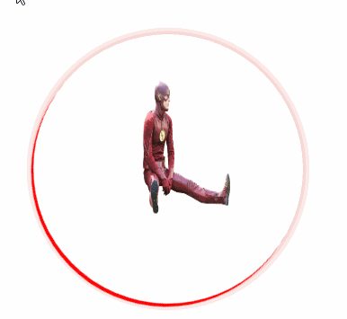

 Dia 3 - Mudança de cor de texto quando entra em outra div

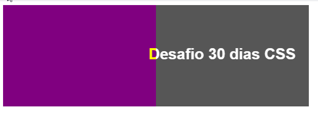

 Dia 4 - Botão com efeito

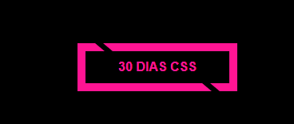

 Dia 5 - Efeito pulsar

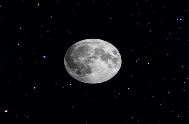

 Dia 6 -Efeito lightning text

 Dia 7 - Preloader animado

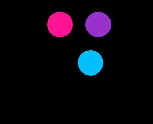

 Dia 8 - Coração batendo

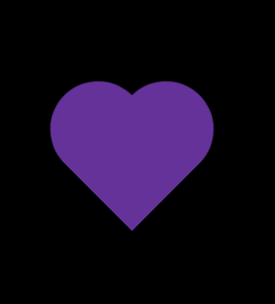

Dia 9 - Pendulo de Newton

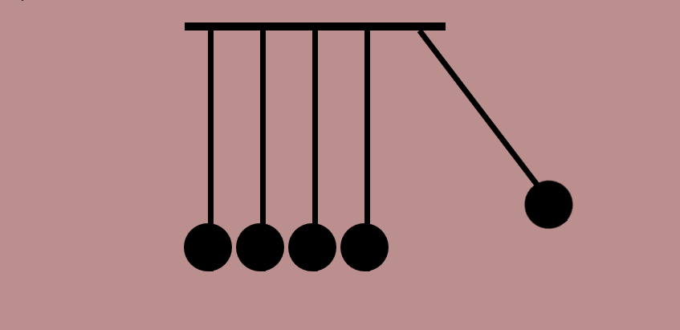

 Dia 10 - Animação texto alternando

 Dia 11 - Botão com efeito hover

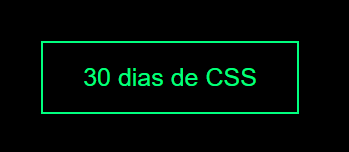

 Dia 12 - Efeito de preenchimento ao passar o mouse

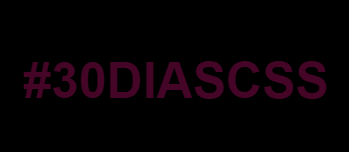

 Dia 13 -  Loading com efeito

 Dia 14 - Fundo de texto animado

 Dia 15 - Texto flutuante

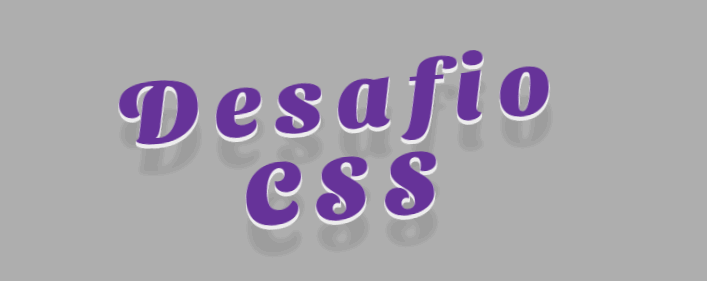

Dia 16 - Botão com efeito

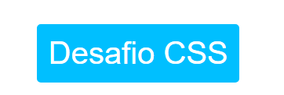

 Dia 17 - Loader animado

 Dia 18 - Texto esfumaçado

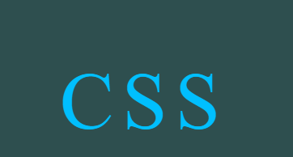

Dia 19 - Efeitos de animação de fundo de partículas

 Dia 20 - Botão com efeito

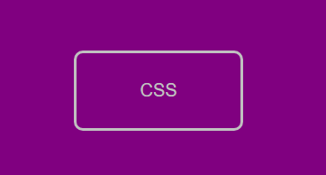

Dia 21 - Esferas quicando

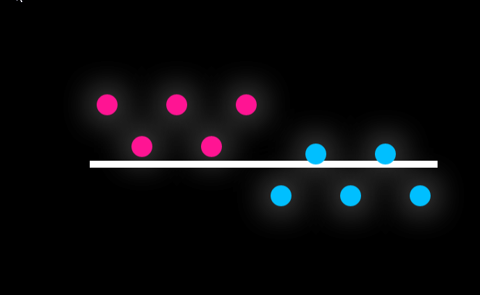

Dia 22 - Icones com efeito

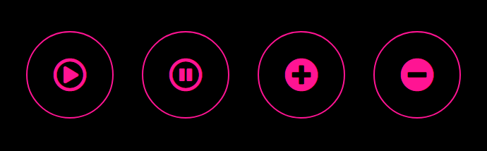

Dia 23 - Botão com efeito hover

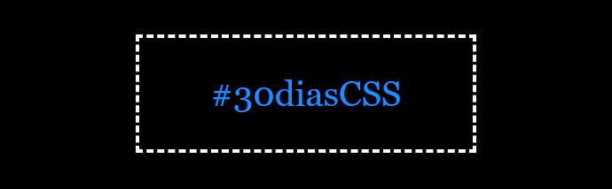

Dia 24 - Preloader animado

Dia 25 - Checkbox animado

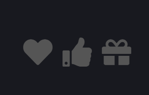

Dia 26 - Loading com efeito

Dia 27 - Efeito pulsar

Dia 28 - Cor do background mudando

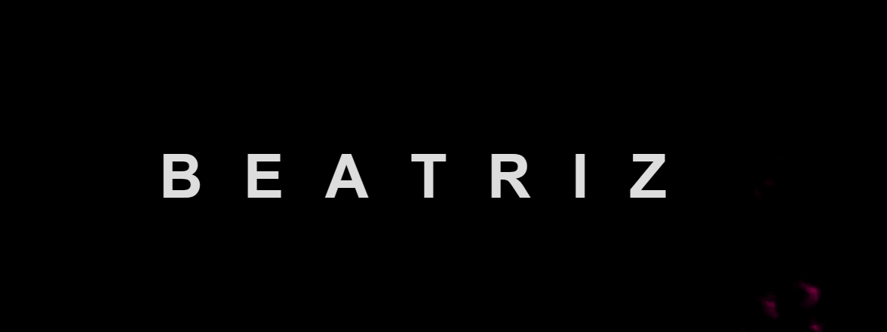

Dia 29 - Menu responsivo com Media Queries

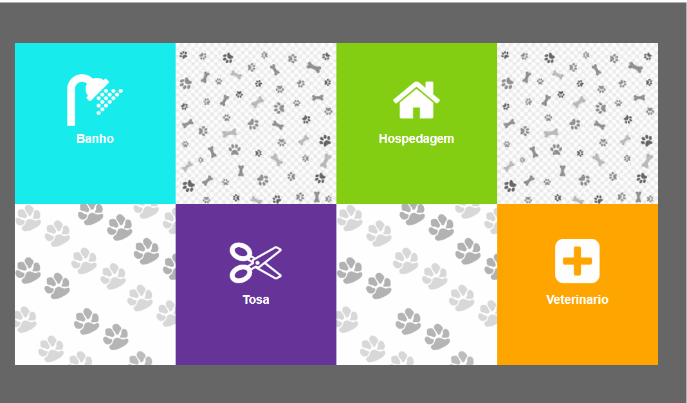

Dia 30 - Fogos de artificio

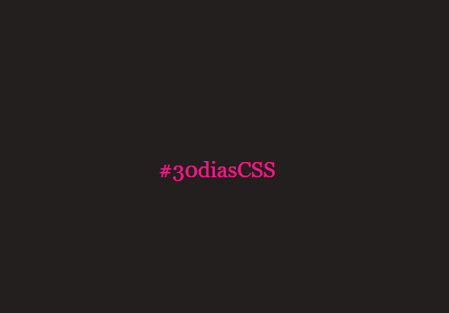
